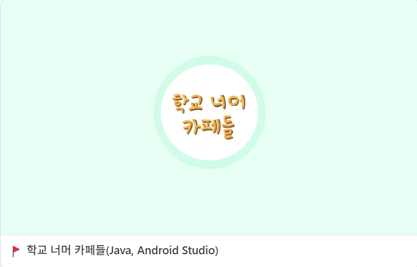

<a href="https://kravie403.github.io/projects/main-projects/dungeons/">
      

## 👤 **자기 소개**

안녕하세요! 저는 IT 정보공학을 전공하는 대학생입니다. 새로운 도전을 즐기고 끊임없이 문제를 해결하며 성장하는 게임 프로그래머입니다.  
  
더 좋은 개발을 하기 위해 게임 개발만 말고도 `기획`, `디자인`, `작곡` 등 다양한 분야를 꾸준히 배워가고 있습니다.  

  
  

## 🎓 **학력**

**전북대학교**  
IT 정보공학과 (2020 - 현재)
  
  

## 💼 **경력**

### **AI 기반 모션 인식 시스템 콘텐츠 개발**  
  8주 동안 텔로스 기업에서 AI 기반 모션 인식 시스템을 통한 콘텐츠 개발을 진행하였습니다.  

### **OTT 셋톱박스 모션 검출 시스템**  
  OTT 셋톱박스에 연결된 카메라를 통해 모션 검출 및 객체 인식을 수행하는 시스템 개발 프로젝트에 참여. 캡스톤 경진대회에서 최우수상 수상.
  
  

## **PC 사용 능력**  

  

# **보유 기술**

### **프로그래밍 언어**
C#, Python, C++  
  

### **프레임 워크**
Unity, Firebase  
  

### **데이터베이스**
MySQL, Firebase
  

### **도구 및 기술**
Git, Visual Studio, Visual Code, Anaconda, Blender, GIMP
  

### **ERD 도구**
ERDCloud  
  

ERDCloud
<a href="https://www.erdcloud.com/d/8FHkuNeQwxYg3hQNJ">
      
  

## **언어**  

### 한국어 :kr:

원어민

### 영어 :us:

OPIC - Intermediate High
  
  
  

## 🕹️ **메인 프로젝트**

<a href="https://kravie403.github.io/projects/main-projects/dungeons/">
      
    

<a href="https://kravie403.github.io/projects/main-projects/go-run-jump/">
    

  

## 📖 **그 외 프로젝트**

<a href="https://kravie403.github.io/projects/sub-projects/gone/">
      

<a href="https://kravie403.github.io/projects/sub-projects/cafe-beyond-the-university/">
      

<a href="https://kravie403.github.io/projects/sub-projects/motion-detection-object-recognition/">
      
  
  