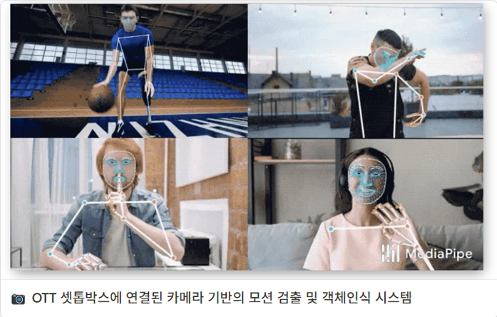

## 👤 **Self Introduction**

Hello! I am an undergraduate student majoring in IT Information Engineering. I enjoy solving problems through technology and challenging myself with new projects.
  
  

## 🎓 **Education**

**Jeonbuk National University**  
Department of IT Information Engineering (2020 - Present)
  
  

## 💼 **Experience**

### **AI-Based Motion Recognition System Content Development**  
  Developed content using an AI-based motion recognition system during an 8-week internship at Telos Corporation.  

### **OTT Set-Top Box Motion Detection System**  
  Participated in the development of a system that performs motion detection and object recognition through a camera connected to an OTT set-top box. Won the top prize at the Capstone Design Contest.
  
  

## 🛠 **Skills**

### **Languages**  
C#, Python, C++  

### **Frameworks**  
Unity, Firebase, Hugo  

### **Tools**  
Git, Visual Studio, Visual Code, Anaconda, Blender, GIMP
  
  

## 🥏 **Languages**

### Korean :kr:  
Native Speaker

### English :us:  
OPIC - Intermediate High
  
  

## 🕹️ **Main Projects**

<a href="https://kravie403.github.io/projects/main-projects/dungeons/">
      
    

<a href="https://kravie403.github.io/projects/main-projects/go-run-jump/">
    

  

## 📖 **Other Projects**

<a href="https://kravie403.github.io/projects/sub-projects/gone/">
      

<a href="https://kravie403.github.io/projects/sub-projects/cafe-beyond-the-university/">
      

<a href="https://kravie403.github.io/projects/sub-projects/motion-detection-object-recognition/">
      
  
