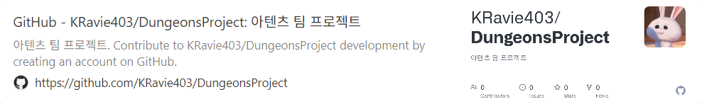

Our team of six created a turn-based RPG game based on Unity.

<!--more-->
  

**Game Introduction**

Strategize with various heroes to thwart the boss's attacks.

___________________________________________________

Enjoy strategic cooperative play with heroes by analyzing skills and interactions within limited turns!

Experience the teamwork of the four heroes leading to victory!  
    

## **Responsibilities**  

### • UI  

&nbsp;\- Title Scene  
&nbsp;&nbsp;Character configuration  
&nbsp;&nbsp;Skill configuration  
&nbsp;&nbsp;Map configuration  
&nbsp;&nbsp;Functionality (+DB) implementation  
___________________________________________________
&nbsp;\- Loading Scene  
&nbsp;&nbsp;Map setup  
___________________________________________________
&nbsp;\- Main Scene  
&nbsp;&nbsp;Character status window  
&nbsp;&nbsp;Inventory window  
___________________________________________________
&nbsp;\- Ending Scene  
&nbsp;&nbsp;Ending screen and character window  
  
  
## **Game Design and Concept Introduction**

### **Intro Scene**
.png)
___________________________________________________  

### **Title Scene**  
  
\-**Game Start Screen** (Start Game, Settings, Quit Game)  
.png)
___________________________________________________  
  
\-**Settings** (Adjust background music/effects volume, brightness, change resolution)  
.png)
___________________________________________________  
  
\-**Start Game**
.png)
___________________________________________________  
  
\-**Map Selection**
.png)
___________________________________________________  
  
\-**Character Selection**
.png)
___________________________________________________  
  
\-**Skill Selection**
.png)
___________________________________________________  
  
### **Scene Loader**
.png)
___________________________________________________  

(After settings are completed)  
  
### **Main Scene**
.png)
___________________________________________________  
  
-(Esc)**PAUSE** (Resume, Settings, Quit Game)  
.png )
___________________________________________________  
  
### **Ending Scene Loader**
.png)
___________________________________________________  
  
### **Ending Loading Scene**
.png)
  
  

## **GitHub**

