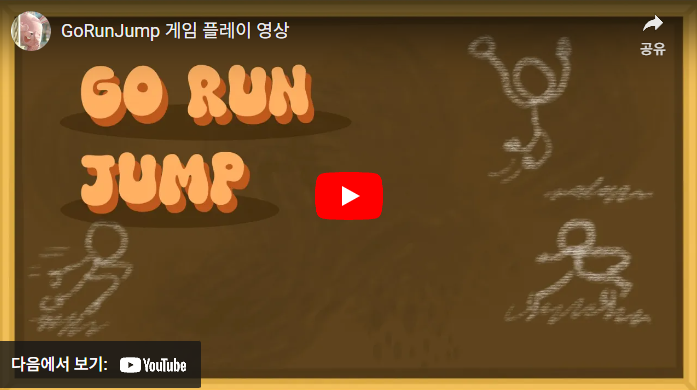
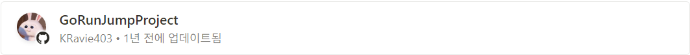

A Unity-based mobile racing game developed by a single developer.

<!--more-->
  

## **Game Introduction**

Each stage has a unique design,  
and players race towards the finish line of each stage.  
This game helps improve the player's control skills.  
  
   

## **Game Development Process**  

### • Idea and Concept
&nbsp;\- Initial idea and development of the game's main concept  

### • Platform Selection  
&nbsp;\- Mobile platform (Design UI tailored to the platform)

### • Programming  
&nbsp;\- Use of game engine  
&nbsp;\- Code writing  
&nbsp;\- Development of game logic and physics engine  

### • Testing and Debugging  
&nbsp;\- Game testing and bug fixing  
  
  
## **Game Images**

.png)
___________________________________________________  
.png)
___________________________________________________   
.png)
___________________________________________________  
.png)
___________________________________________________  
.png)
___________________________________________________  
.png)
  
  
  

## **Video Link**

  

## **GitHub**

