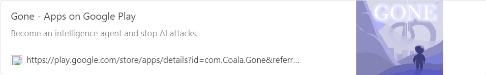
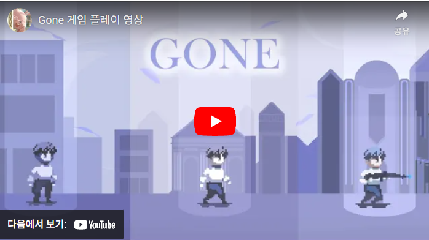
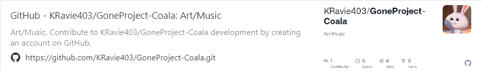

A team of three developed a Unity-based Retro 2D game.

COALA_JBNU  

<!--more-->

  

## **Game Introduction**

Become an intelligence agent and thwart the AI's attacks.

___________________________________________________

A chaotic city caused by the super-intelligent AI “Curi”...  

As a former intelligence agent, you have the power to protect the world.  

Become a hero by defeating the monsters (who might be people) spawned by Curi and safeguard the world.  

Through battles and choices, you can achieve 12 different endings and collect 17 ending collectibles.  
    

## **Additional Information**  
Rated for ages 12 and up  
Violence  
  

## **Game Specifications**  
 • Supported Platform: Android (Google Play Store)  
  

## **Responsibilities**

### • Trailer Production
&nbsp;&nbsp;Created animations using OpenToonz.  

### • Background Music Composition
&nbsp;&nbsp;Composed all the background music used in each stage.  

### • Art Production
&nbsp;&nbsp;Produced most of the art in the game, including:  
&nbsp;&nbsp;`Characters` `Monsters` `Weapons` `Effects` `Items` `Maps` `Chat System` `Ending Scenes` `UI`
  
  

## **Gameplay Images**

.png)

.png) 
  
.png)
  
  
  

## **Video Link**

  

## **GitHub**

