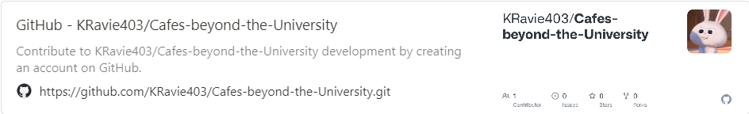

I developed a cafe recommendation app using the map API in Android Studio.  

<!--more-->
  

## **Purpose and Necessity of the App**

-"Kagong-jok," a newly coined term, reflects the growing trend of consumers searching for cafes to study and those looking for unique cafes for social media activities. 

&nbsp;&nbsp;Therefore, the purpose of developing this app is to recommend cafes that provide suitable environments based on consumer needs.  
    

## **Responsibilities**

### • UI

\- Implementation of the main page

\- Implementation of the cafe information page
___________________________________________________
\- Integration with the map API
___________________________________________________
\- Icon design
  
  

## **App Design and User Interface**

.png)

.png) 
  
.png)
  
  
  

## **GitHub**

