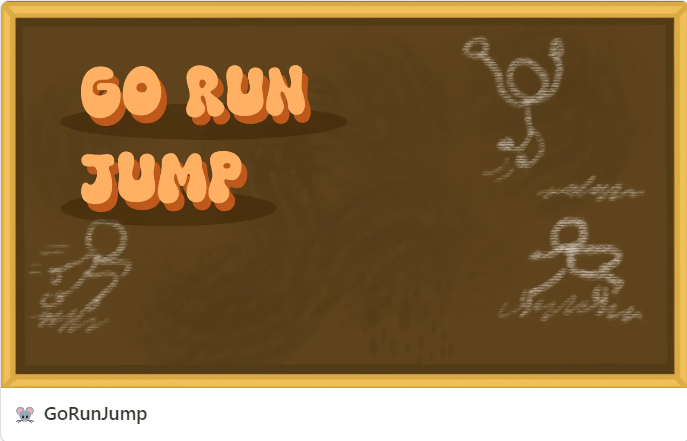

## 👤 자기 소개

안녕하세요! 저는 IT 정보공학을 전공하는 대학생입니다. 기술을 통해 문제를 해결하고, 새로운 프로젝트에 도전하는 것을 좋아합니다.
  

## 🎓 학력

- **전북대학교**  
  IT 정보공학과 (2020 - 현재)
  

## 💼 경력

- **AI 기반 모션 인식 시스템 콘텐츠 개발**  
  8주 동안 텔로스 기업에서 AI 기반 모션 인식 시스템을 통한 콘텐츠 개발을 진행하였습니다.

- **OTT 셋톱박스 모션 검출 시스템**  
  OTT 셋톱박스에 연결된 카메라를 통해 모션 검출 및 객체 인식을 수행하는 시스템 개발 프로젝트에 참여. 캡스톤 경진대회에서 최우수상 수상.
  

## 🛠 보유 기술

- **Languages**: C#, Python, C++
- **Frameworks**: Unity, Firebase, Hugo
- **Tools**: Git, Visual Studio, Visual Code, Anaconda, Blender, GIMP
  

## 🥏 언어  

### 한국어 :kr:

원어민

### 영어 :us:

OPIC - Intermediate High
  

## 🕹️ 메인 프로젝트

<a href="https://kravie403.github.io/projects/main-projects/dungeons/">
      
    

<a href="https://kravie403.github.io/projects/main-projects/go-run-jump/">
    

  

## 📖 그 외 프로젝트

<a href="https://kravie403.github.io/projects/sub-projects/gone/">
      

<a href="https://kravie403.github.io/projects/sub-projects/cafe-beyond-the-university/">
      

<a href="https://kravie403.github.io/projects/sub-projects/motion-detection-object-recognition/">
      
  

## 🎯 관심사

\- 게임 개발