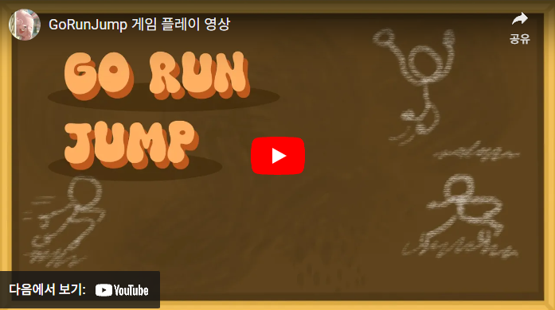

1인 개발 Unity 기반 모바일 레이싱 게임입니다.

<!--more-->
  

# **게임 소개**

스테이지마다 독특한 디자인을 갖고 있으며,  
플레이어는 각 스테이지의 골인 지점을 향해 레이싱하는 게임입니다.  
이 게임은 플레이어의 컨트롤 스킬을 향상시키는 데 도움을 줍니다.  
  
   

# **게임 제작 과정**  

### • 아이디어 및 컨셉
&nbsp;\-초기 아이디어 및 게임의 주요 컨셉 개발  

### • 플랫폼 선택  
&nbsp;\-모바일 플랫폼 (플랫폼에 맞는 UI 디자인 설계)

### • 프로그래밍  
&nbsp;\-게임 엔진 사용  
&nbsp;\-코드 작성  
&nbsp;\-게임 로직, 물리 엔진 개발  

### • 테스팅 및 디버깅  
&nbsp;\-게임 테스트 및 버그 수정  
  
  
# **게임 이미지**

.png)
___________________________________________________  
.png)
___________________________________________________   
.png)
___________________________________________________  
.png)
___________________________________________________  
.png)
___________________________________________________  
.png)
  
  
  

# **영상 링크**

    

  

# **GitHub**
[.png)](https://github.com/KRavie403/GoRunJumpProject)