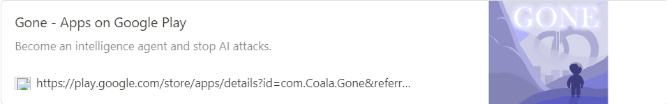
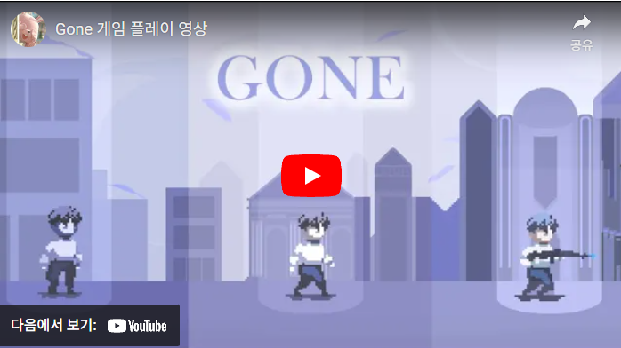
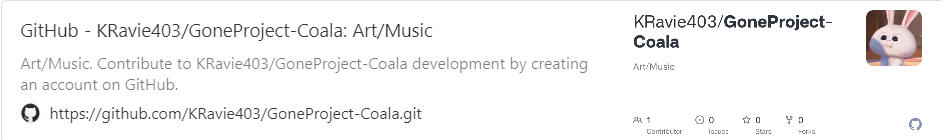

팀원 3명에서 Unity 기반 Retro2D 게임을 제작하였습니다.

COALA_JBNU  

<!--more-->

  

## **게임 소개**

정보국 요원이 되어 AI의 공격을 저지하세요.

___________________________________________________

초인공 지능 “큐리”가 발생시킨 전파로 인해 혼란스러운 도시…  

당신은 전직 정보국 요원으로 세상을 지킬 힘이 있습니다.  

큐리로 인해 생겨난 몬스터(어쩌면 사람일 수도)를 무찌르고 세상을 지키는 영웅이 되어 주세요.  

전투와 선택을 통해 12가지의 엔딩 및 17가지 엔딩 컬렉션을 흭득할 수 있습니다.  
    

## **추가 정보**  
12세 이상  
폭력  
  

## **게임 사양**  
 • 지원 플랫폼 : Android (Google플레이 스토어)  
  

## **담당 파트**

### • 트레일러 영상 제작
&nbsp;&nbsp;OpenToonz를 활용하여 애니메이션을 제작하였습니다.  

### • 배경음악 작곡
&nbsp;&nbsp;각 스테이지에 적용되는 배경 음악을 모두 작곡하였습니다.  

### • 아트 제작
&nbsp;&nbsp;게임에 나오는 대부분의 아트를 제작하였습니다.  
&nbsp;&nbsp;`인물` `몬스터` `무기`  `이펙트` `아이템` `맵` `채팅시스템` `엔딩씬` `UI`
  
  

## **플레이 이미지**

.png)

.png) 
  
.png)
  
  
  

## **영상 링크**

  

## **GitHub**
